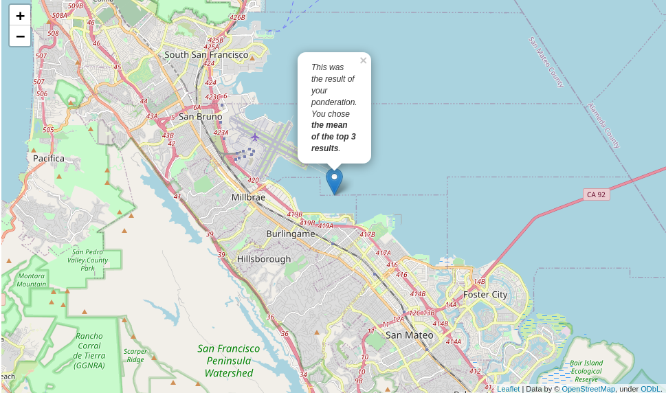

# GeoData Querying and Prediction

For this project, we wanted to select the best possible location to build the offices for a gaming start-up. 

This is the current result:

We began with crunchbase's dataset of thousands of companies and did some basic data wrangling and exploration.
The first step was to identify the companies which had raised at least 1 Million USD, then we looked at how many of those companies had available location data to start working with.

We connected to the Foursquare API, and did some queries to find locations which matched the type of venues we were interested in (Airports, coffee shops, daycares, basketball courts, business centers, nightlife places, and also included some other lifestyle perks).

We created a MongoDB collection to store all out GeoPoints (a JSON Standard format), we then set up a `2dindex` which allowed us to leverage on the `$near` feature of MongoDB. 

I wanted to think more of the `BigPicture`, as a way to bin different categories into a broader one. `kids_venues`, for example, includes daycares, elementary schools, parks, and so on.

Finally, after developing a group of querying and categorizing functions, we were able to generate a pandas dataframe from which we can use the function `pd.DataFrame.sort_by()`, and get the most relevant match to our `BigPicture` specifications.

The 'Sandbox' allows the use of top-ranked locations to generate a prediction of the best possible spot, by calculating the means of the latitudes and longitudes of the `top rank`.

`Folium` allows us to have the output image used as the banner 

